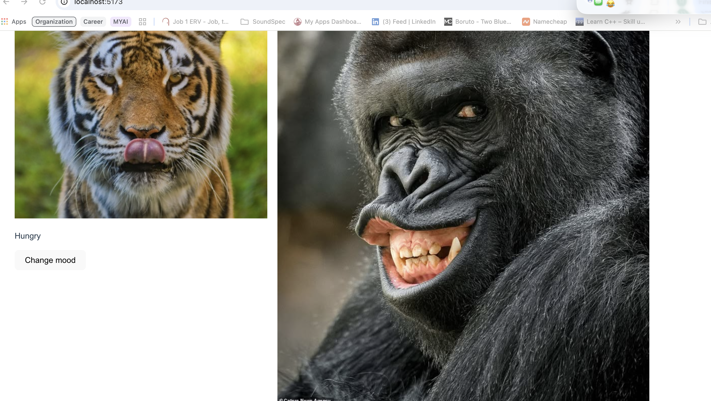

# Pet Kennel

Pet Kennel is a React app that displays pets and lets the user cycle through each pet's images and moods. It was built to practice class-based React components, state, props, callbacks, and rendering lists with `.map()`.

## Description

The parent `App` component stores the pet data in state. It maps over that data and passes each pet to a `ChildComponent`. When a user clicks a button, the child sends the pet's ID back to the parent, and the parent updates that pet's image and status.

## Installation

Prerequisites: Node.js 18 or newer and npm.

```bash
git clone https://github.com/mofex99/petKennel.git
cd petKennel
npm install
```

## Usage

Start the development server:

```bash
npm run dev
```

Open the local URL shown in the terminal, usually `http://localhost:5173`. Each pet card displays a name, image, and status. Click **Change mood** to cycle that pet to its next image and status.

To check the project before submitting:

```bash
npm run lint
npm run build
```

## Screenshots

Add a screenshot of the running app at `public/pet-kennel-screenshot.png`, then use this image in the README:



## Technologies Used

- React 19
- Vite 7
- JavaScript
- Node.js and npm

## Contributing

This is a learning project. Suggestions and pull requests are welcome.

## License

This project is licensed under the [MIT License](https://choosealicense.com/licenses/mit/).
